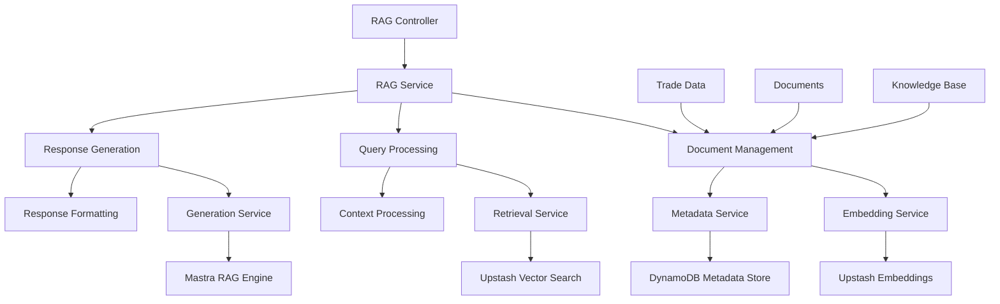
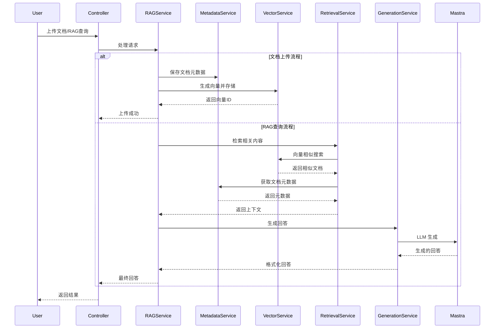
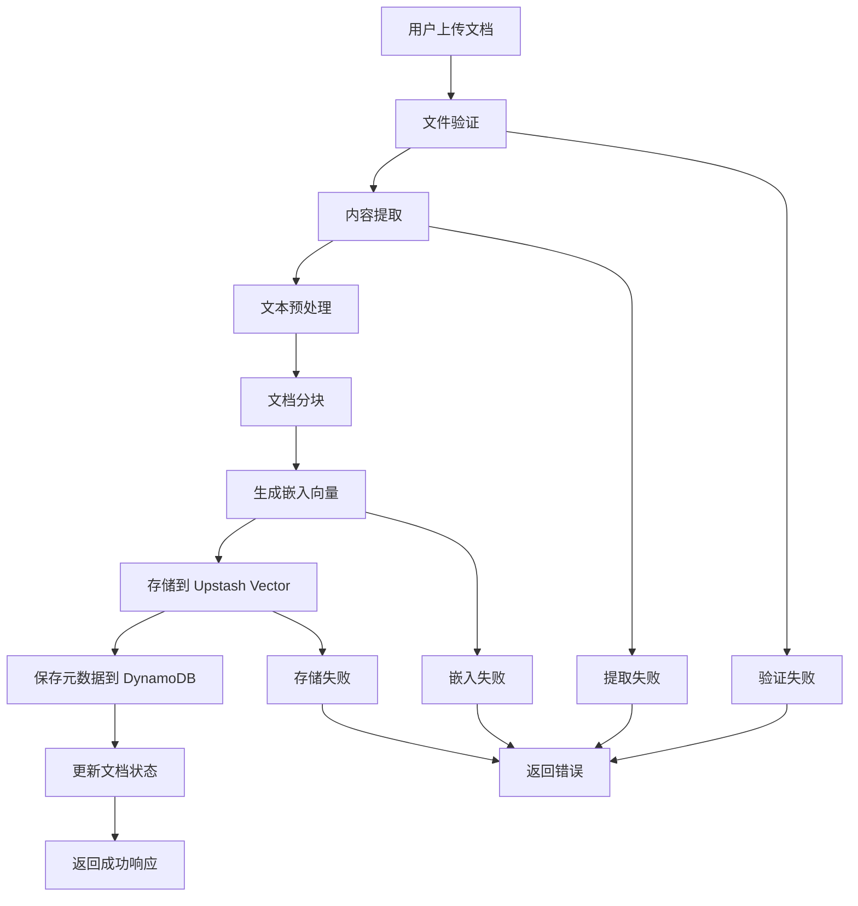
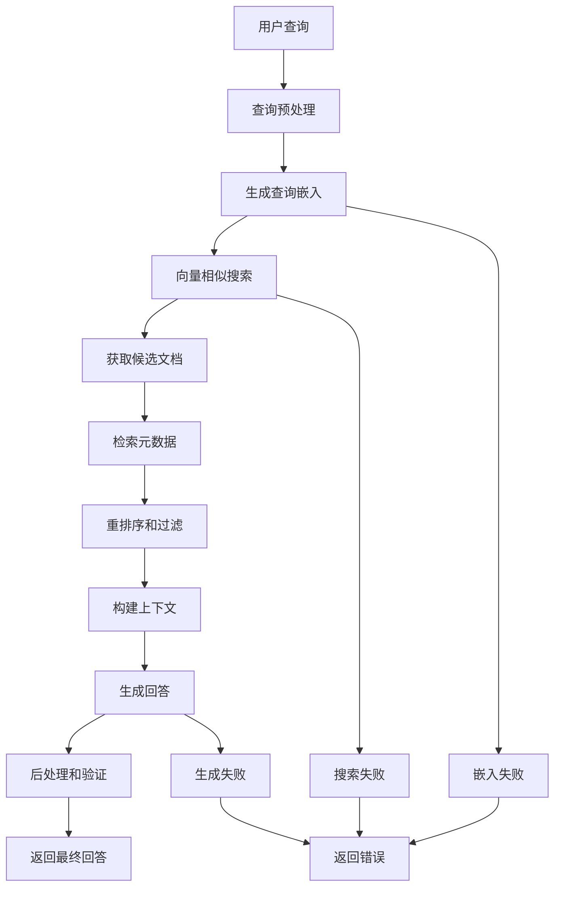
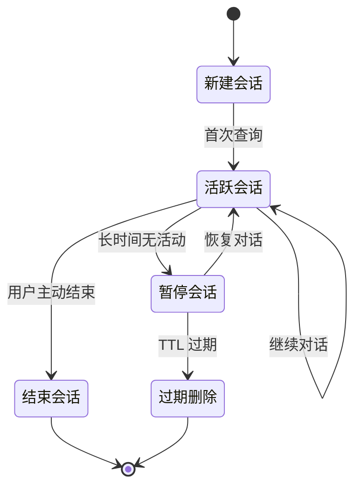

# Trade-Backend RAG 模块架构设计方案

## 1. 项目概述

### 1.1 目标
为 trade-backend NestJS 项目添加一个智能 RAG（Retrieval-Augmented Generation）模块，创建多用途的交易智能助手系统，支持：
- 交易记录的智能检索和分析
- 交易文档和知识库的智能问答
- 用户交易行为模式分析
- 个性化交易建议和风险评估

### 1.2 技术栈
- **后端框架**: NestJS + TypeScript
- **向量存储**: Upstash Vector Database
- **元数据存储**: AWS DynamoDB
- **缓存**: Upstash Redis (按需)
- **嵌入模型**: Upstash ChatGPT 嵌入模型
- **RAG 引擎**: Mastra RAG 模块
- **部署**: AWS Lambda + CDK

## 2. 系统架构设计

### 2.1 架构概览



### 2.2 数据流程



## 3. 模块文件结构

```
src/modules/rag/
├── rag.module.ts                 # RAG 模块定义
├── rag.controller.ts             # RAG API 控制器
├── rag.service.ts                # RAG 主服务
├── dto/
│   ├── create-document.dto.ts    # 创建文档 DTO
│   ├── update-document.dto.ts    # 更新文档 DTO
│   ├── rag-query.dto.ts          # RAG 查询 DTO
│   ├── rag-response.dto.ts       # RAG 响应 DTO
│   └── document-filter.dto.ts    # 文档过滤 DTO
├── entities/
│   ├── document.entity.ts        # 文档实体
│   ├── embedding-metadata.entity.ts  # 嵌入元数据实体
│   └── chat-session.entity.ts    # 聊天会话实体
├── services/
│   ├── embedding.service.ts      # 嵌入服务
│   ├── vector.service.ts         # 向量操作服务
│   ├── metadata.service.ts       # 元数据管理服务
│   ├── retrieval.service.ts      # 检索服务
│   ├── generation.service.ts     # 生成服务
│   └── document.service.ts       # 文档管理服务
├── integrations/
│   ├── upstash-vector.service.ts # Upstash Vector 集成
│   ├── upstash-redis.service.ts  # Upstash Redis 集成 (可选)
│   ├── mastra-rag.service.ts     # Mastra RAG 集成
│   └── openai.service.ts         # OpenAI API 集成
├── types/
│   ├── rag.types.ts              # RAG 相关类型
│   ├── vector.types.ts           # 向量相关类型
│   └── document.types.ts         # 文档相关类型
└── utils/
    ├── text-splitter.util.ts     # 文本分割工具
    ├── embedding.util.ts         # 嵌入工具
    └── validation.util.ts        # 验证工具
```

## 4. 数据模型设计

### 4.1 DynamoDB 表设计

#### 4.1.1 RAG Documents 表 (文档元数据)
```typescript
interface DocumentEntity {
  // 主键
  userId: string;              // 分区键 - 用户ID
  documentId: string;          // 排序键 - 文档ID
  
  // 文档基本信息
  title: string;               // 文档标题
  documentType: 'trade' | 'knowledge' | 'manual' | 'report'; // 文档类型
  contentType: string;         // 内容类型 (pdf, docx, txt, md)
  originalFileName: string;    // 原始文件名
  fileSize: number;            // 文件大小
  
  // 向量化信息
  embeddingIds: string[];      // Upstash Vector 中的向量ID列表
  chunkCount: number;          // 分块数量
  totalTokens: number;         // 总token数
  embeddingModel: string;      // 使用的嵌入模型
  
  // 元数据
  metadata: {
    source?: string;           // 来源
    author?: string;           // 作者
    tags?: string[];           // 标签
    category?: string;         // 分类
    priority?: 'high' | 'medium' | 'low'; // 优先级
    isPublic?: boolean;        // 是否公开
    tradeSymbol?: string;      // 交易品种 (交易相关文档)
    dateRange?: {              // 时间范围
      from: string;
      to: string;
    };
  };
  
  // 状态信息
  status: 'processing' | 'completed' | 'failed' | 'deleted'; // 处理状态
  processingProgress?: number; // 处理进度 (0-100)
  errorMessage?: string;       // 错误信息
  
  // 时间戳
  createdAt: string;           // 创建时间
  updatedAt: string;           // 更新时间
  lastAccessedAt?: string;     // 最后访问时间
}
```

#### 4.1.2 RAG Chat Sessions 表 (聊天会话)
```typescript
interface ChatSessionEntity {
  // 主键
  userId: string;              // 分区键 - 用户ID
  sessionId: string;           // 排序键 - 会话ID
  
  // 会话信息
  title: string;               // 会话标题
  sessionType: 'trade_analysis' | 'knowledge_qa' | 'general'; // 会话类型
  
  // 上下文信息
  contextDocuments: string[];  // 相关文档ID列表
  conversationHistory: {       // 对话历史
    role: 'user' | 'assistant';
    content: string;
    timestamp: string;
    metadata?: any;
  }[];
  
  // 会话状态
  isActive: boolean;           // 是否活跃
  messageCount: number;        // 消息总数
  
  // 时间戳
  createdAt: string;           // 创建时间
  updatedAt: string;           // 更新时间
  lastMessageAt: string;       // 最后消息时间
}
```

### 4.2 Upstash Vector 数据结构

```typescript
interface VectorRecord {
  id: string;                  // 向量ID (documentId + chunkIndex)
  vector: number[];            // 向量嵌入
  metadata: {
    userId: string;            // 用户ID
    documentId: string;        // 文档ID
    chunkIndex: number;        // 分块索引
    content: string;           // 原始文本内容
    documentType: string;      // 文档类型
    title: string;             // 文档标题
    tags?: string[];           // 标签
    timestamp: string;         // 创建时间
    tokenCount: number;        // token数量
  };
}
```

## 5. 核心服务实现

### 5.1 VectorService (向量服务)
```typescript
@Injectable()
export class VectorService {
  private upstashVector: UpstashVector;

  async storeEmbeddings(
    documentId: string,
    chunks: TextChunk[],
    embeddings: number[][]
  ): Promise<string[]>

  async searchSimilar(
    queryEmbedding: number[],
    options: SearchOptions
  ): Promise<SearchResult[]>

  async deleteDocumentVectors(
    documentId: string
  ): Promise<void>

  async updateVectorMetadata(
    vectorId: string,
    metadata: Partial<VectorMetadata>
  ): Promise<void>
}
```

### 5.2 MetadataService (元数据服务)
```typescript
@Injectable()
export class MetadataService {
  async createDocument(
    userId: string,
    documentData: CreateDocumentDto
  ): Promise<DocumentEntity>

  async getDocument(
    userId: string,
    documentId: string
  ): Promise<DocumentEntity>

  async updateDocument(
    userId: string,
    documentId: string,
    updates: Partial<DocumentEntity>
  ): Promise<DocumentEntity>

  async deleteDocument(
    userId: string,
    documentId: string
  ): Promise<void>

  async listDocuments(
    userId: string,
    filters?: DocumentFilter
  ): Promise<DocumentEntity[]>
}
```

### 5.3 RetrievalService (检索服务)
```typescript
@Injectable()
export class RetrievalService {
  async retrieveRelevantContext(
    userId: string,
    query: string,
    options: RetrievalOptions
  ): Promise<RetrievalResult>

  async hybridSearch(
    userId: string,
    query: string,
    filters: SearchFilters
  ): Promise<SearchResult[]>

  async rerankResults(
    results: SearchResult[],
    query: string
  ): Promise<SearchResult[]>
}
```

### 5.4 GenerationService (生成服务)
```typescript
@Injectable()
export class GenerationService {
  async generateResponse(
    query: string,
    context: RetrievalResult,
    options: GenerationOptions
  ): Promise<RAGResponse>

  async generateChatResponse(
    sessionId: string,
    message: string,
    context: RetrievalResult
  ): Promise<ChatResponse>

  async summarizeDocument(
    documentId: string,
    userId: string
  ): Promise<DocumentSummary>
}
```

## 6. API 接口设计

### 6.1 文档管理接口

```typescript
// POST /rag/documents - 上传文档
@Post('documents')
async uploadDocument(
  @Req() req: Request,
  @Body() dto: CreateDocumentDto,
  @UploadedFile() file: Express.Multer.File
): Promise<APIResponse<DocumentEntity>>

// GET /rag/documents - 获取文档列表
@Get('documents')
async getDocuments(
  @Req() req: Request,
  @Query() query: DocumentFilterDto
): Promise<APIResponse<DocumentEntity[]>>

// GET /rag/documents/:id - 获取单个文档
@Get('documents/:id')
async getDocument(
  @Req() req: Request,
  @Param('id') documentId: string
): Promise<APIResponse<DocumentEntity>>

// PUT /rag/documents/:id - 更新文档
@Put('documents/:id')
async updateDocument(
  @Req() req: Request,
  @Param('id') documentId: string,
  @Body() dto: UpdateDocumentDto
): Promise<APIResponse<DocumentEntity>>

// DELETE /rag/documents/:id - 删除文档
@Delete('documents/:id')
async deleteDocument(
  @Req() req: Request,
  @Param('id') documentId: string
): Promise<APIResponse<void>>
```

### 6.2 RAG 查询接口

```typescript
// POST /rag/query - RAG 查询
@Post('query')
async ragQuery(
  @Req() req: Request,
  @Body() dto: RAGQueryDto
): Promise<APIResponse<RAGResponse>>

// POST /rag/chat - 多轮对话
@Post('chat')
async chatQuery(
  @Req() req: Request,
  @Body() dto: ChatQueryDto
): Promise<APIResponse<ChatResponse>>

// GET /rag/sessions - 获取聊天会话列表
@Get('sessions')
async getChatSessions(
  @Req() req: Request
): Promise<APIResponse<ChatSessionEntity[]>>

// POST /rag/sessions - 创建新会话
@Post('sessions')
async createChatSession(
  @Req() req: Request,
  @Body() dto: CreateSessionDto
): Promise<APIResponse<ChatSessionEntity>>

// GET /rag/sessions/:id/history - 获取会话历史
@Get('sessions/:id/history')
async getSessionHistory(
  @Req() req: Request,
  @Param('id') sessionId: string
): Promise<APIResponse<ChatMessage[]>>

// DELETE /rag/sessions/:id - 删除会话
@Delete('sessions/:id')
async deleteSession(
  @Req() req: Request,
  @Param('id') sessionId: string
): Promise<APIResponse<void>>
```

### 6.3 分析和统计接口

```typescript
// GET /rag/analytics - 获取使用统计
@Get('analytics
')
async getAnalytics(
  @Req() req: Request,
  @Query() query: AnalyticsQueryDto
): Promise<APIResponse<RAGAnalytics>>

// POST /rag/feedback - 提交反馈
@Post('feedback')
async submitFeedback(
  @Req() req: Request,
  @Body() dto: FeedbackDto
): Promise<APIResponse<void>>
```

## 7. CDK 基础设施配置

### 7.1 DynamoDB 表配置

在 `trade-backend/cdk/lib/cdk-stack.ts` 中添加以下配置：

```typescript
// RAG Documents Table for metadata storage
const ragDocumentsTable = new dynamodb.Table(
  this,
  `${appName}RAGDocumentsTable${envName}`,
  {
    tableName: `${appName}-rag-documents-${envName.toLowerCase()}`,
    partitionKey: { name: 'userId', type: dynamodb.AttributeType.STRING },
    sortKey: { name: 'documentId', type: dynamodb.AttributeType.STRING },
    billingMode: dynamodb.BillingMode.PAY_PER_REQUEST,
    removalPolicy: envName === 'prod' 
      ? cdk.RemovalPolicy.RETAIN 
      : cdk.RemovalPolicy.DESTROY,
    pointInTimeRecovery: envName === 'prod',
    stream: dynamodb.StreamViewType.NEW_AND_OLD_IMAGES,
  },
);

// Add Global Secondary Index for document type queries
ragDocumentsTable.addGlobalSecondaryIndex({
  indexName: 'DocumentTypeIndex',
  partitionKey: { name: 'userId', type: dynamodb.AttributeType.STRING },
  sortKey: { name: 'documentType', type: dynamodb.AttributeType.STRING },
  projectionType: dynamodb.ProjectionType.ALL,
});

// Add Global Secondary Index for status queries
ragDocumentsTable.addGlobalSecondaryIndex({
  indexName: 'StatusIndex',
  partitionKey: { name: 'userId', type: dynamodb.AttributeType.STRING },
  sortKey: { name: 'status', type: dynamodb.AttributeType.STRING },
  projectionType: dynamodb.ProjectionType.ALL,
});

// RAG Chat Sessions Table
const ragChatSessionsTable = new dynamodb.Table(
  this,
  `${appName}RAGChatSessionsTable${envName}`,
  {
    tableName: `${appName}-rag-chat-sessions-${envName.toLowerCase()}`,
    partitionKey: { name: 'userId', type: dynamodb.AttributeType.STRING },
    sortKey: { name: 'sessionId', type: dynamodb.AttributeType.STRING },
    billingMode: dynamodb.BillingMode.PAY_PER_REQUEST,
    removalPolicy: envName === 'prod' 
      ? cdk.RemovalPolicy.RETAIN 
      : cdk.RemovalPolicy.DESTROY,
    pointInTimeRecovery: envName === 'prod',
    timeToLiveAttribute: 'ttl', // Auto-delete old sessions
  },
);

// Add TTL index for automatic cleanup of old sessions
ragChatSessionsTable.addGlobalSecondaryIndex({
  indexName: 'SessionTypeIndex',
  partitionKey: { name: 'userId', type: dynamodb.AttributeType.STRING },
  sortKey: { name: 'sessionType', type: dynamodb.AttributeType.STRING },
  projectionType: dynamodb.ProjectionType.ALL,
});

// Grant Lambda permissions for RAG tables
ragDocumentsTable.grantReadWriteData(fn);
ragChatSessionsTable.grantReadWriteData(fn);

// Add RAG environment variables to Lambda
fn.addEnvironment('RAG_DOCUMENTS_TABLE_NAME', ragDocumentsTable.tableName);
fn.addEnvironment('RAG_CHAT_SESSIONS_TABLE_NAME', ragChatSessionsTable.tableName);

// Add CDK outputs for RAG tables
new cdk.CfnOutput(this, 'RAG_DOCUMENTS_TABLE_NAME', {
  value: ragDocumentsTable.tableName,
  description: `Name of the DynamoDB table for RAG documents in ${appName} ${envName}`,
});

new cdk.CfnOutput(this, 'RAG_CHAT_SESSIONS_TABLE_NAME', {
  value: ragChatSessionsTable.tableName,
  description: `Name of the DynamoDB table for RAG chat sessions in ${appName} ${envName}`,
});
```

## 8. 依赖包管理

### 8.1 新增依赖包

```json
{
  "dependencies": {
    // Mastra RAG 相关
    "@mastra/core": "^0.10.3",
    "@mastra/memory": "^0.10.2", 
    "@mastra/rag": "^0.10.x",
    
    // Upstash 服务
    "@upstash/vector": "^1.1.5",
    "@upstash/redis": "^1.34.0",
    
    // AI 和嵌入
    "openai": "^4.67.0",
    "@ai-sdk/openai": "^1.0.0",
    
    // 文本处理
    "tiktoken": "^1.0.17",
    "langchain": "^0.3.0",
    "@langchain/textsplitters": "^0.1.0",
    
    // 文件处理
    "pdf-parse": "^1.1.1",
    "mammoth": "^1.8.0",
    "cheerio": "^1.0.0",
    "file-type": "^19.5.0",
    
    // 工具库
    "lodash": "^4.17.21",
    "date-fns": "^4.1.0"
  },
  "devDependencies": {
    "@types/lodash": "^4.17.13",
    "@types/pdf-parse": "^1.1.4"
  }
}
```

### 8.2 环境变量配置

```env
# Upstash Vector Database
UPSTASH_VECTOR_REST_URL=https://your-vector-db.upstash.io
UPSTASH_VECTOR_REST_TOKEN=your_vector_token

# Upstash Redis (可选，用于缓存)
UPSTASH_REDIS_REST_URL=https://your-redis.upstash.io
UPSTASH_REDIS_REST_TOKEN=your_redis_token

# OpenAI API (用于嵌入和生成)
OPENAI_API_KEY=sk-your_openai_key
OPENAI_EMBEDDING_MODEL=text-embedding-3-small
OPENAI_CHAT_MODEL=gpt-4o-mini

# Mastra 配置
MASTRA_RAG_MODEL=gpt-4o-mini
MASTRA_RAG_TEMPERATURE=0.1
MASTRA_RAG_MAX_TOKENS=2000

# RAG 参数配置
RAG_CHUNK_SIZE=1000
RAG_CHUNK_OVERLAP=200
RAG_MAX_RESULTS=10
RAG_SIMILARITY_THRESHOLD=0.7
RAG_MAX_CONTEXT_LENGTH=8000

# DynamoDB 表名 (CDK 自动注入)
RAG_DOCUMENTS_TABLE_NAME=trade-rag-documents-dev
RAG_CHAT_SESSIONS_TABLE_NAME=trade-rag-chat-sessions-dev

# 文件上传限制
RAG_MAX_FILE_SIZE=50MB
RAG_ALLOWED_FILE_TYPES=pdf,docx,txt,md
RAG_MAX_DOCUMENTS_PER_USER=1000

# 安全配置
RAG_ENABLE_CONTENT_FILTER=true
RAG_MAX_QUERIES_PER_MINUTE=60
RAG_SESSION_TTL_HOURS=168  # 7 days
```

## 9. 核心功能实现

### 9.1 文档处理流程



### 9.2 RAG 查询流程



### 9.3 会话管理流程



## 10. 性能优化策略

### 10.1 查询优化

```typescript
// 实现查询缓存
interface QueryCache {
  key: string;           // 查询哈希
  result: RAGResponse;   // 缓存结果
  ttl: number;          // 过期时间
  hitCount: number;     // 命中次数
}

// 实现分层检索
class HierarchicalRetrieval {
  async search(query: string, options: SearchOptions) {
    // 1. 快速检索：使用缓存的热门结果
    const cachedResults = await this.getCachedResults(query);
    if (cachedResults.length > 0) {
      return cachedResults;
    }
    
    // 2. 中等检索：基于用户历史的个性化搜索
    const personalizedResults = await this.getPersonalizedResults(query, options.userId);
    if (personalizedResults.score > 0.8) {
      return personalizedResults.results;
    }
    
    // 3. 全面检索：完整的向量搜索
    return await this.getFullSearchResults(query, options);
  }
}
```

### 10.2 存储优化

```typescript
// 向量压缩和分层存储
class VectorOptimization {
  // 使用量化压缩减少存储空间
  async compressVector(vector: number[]): Promise<Uint8Array> {
    // 实现向量量化压缩
  }
  
  // 分层存储策略
  async storeWithTiering(vectorData: VectorData) {
    if (vectorData.accessFrequency > 10) {
      // 高频访问：存储到热数据层
      await this.storeToHotTier(vectorData);
    } else {
      // 低频访问：存储到冷数据层
      await this.storeToColdTier(vectorData);
    }
  }
}
```

### 10.3 成本控制

```typescript
// 实现智能成本控制
class CostOptimization {
  // 嵌入请求批处理
  async batchEmbedding(texts: string[]): Promise<number[][]> {
    // 将多个文本合并为批处理请求
    const batches = this.createBatches(texts, 100);
    const results = await Promise.all(
      batches.map(batch => this.callEmbeddingAPI(batch))
    );
    return results.flat();
  }
  
  // 令牌使用优化
  async optimizeTokenUsage(context: string, maxTokens: number): Promise<string> {
    if (this.countTokens(context) <= maxTokens) {
      return context;
    }
    
    // 智能截断保留最重要的内容
    return this.intelligentTruncate(context, maxTokens);
  }
}
```

## 11. 安全和隐私保护

### 11.1 数据安全

```typescript
// 数据加密和脱敏
class DataSecurity {
  // 敏感信息脱敏
  async sanitizeContent(content: string): Promise<string> {
    // 移除或替换敏感信息
    return content
      .replace(/\b\d{4}[\s-]?\d{4}[\s-]?\d{4}[\s-]?\d{4}\b/g, '[CARD_NUMBER]')
      .replace(/\b[A-Za-z0-9._%+-]+@[A-Za-z0-9.-]+\.[A-Z|a-z]{2,}\b/g, '[EMAIL]')
      .replace(/\b\d{3}[-.]?\d{3}[-.]?\d{4}\b/g, '[PHONE]');
  }
  
  // 用户数据隔离
  async enforceDataIsolation(userId: string, operation: string) {
    // 确保用户只能访问自己的数据
    if (!this.validateUserAccess(userId, operation)) {
      throw new ForbiddenException('Access denied');
    }
  }
}
```

### 11.2 权限控制

```typescript
// RAG 权限管理
class RAGPermissionManager {
  async checkDocumentAccess(userId: string, documentId: string): Promise<boolean> {
    // 检查用户是否有权限访问特定文档
    const document = await this.metadataService.getDocument(userId, documentId);
    return document.userId === userId || document.metadata.isPublic;
  }
  
  async validateQueryPermissions(userId: string, query: RAGQueryDto): Promise<void> {
    // 验证查询权限
    if (query.documentIds) {
      for (const docId of query.documentIds) {
        if (!await this.checkDocumentAccess(userId, docId)) {
          throw new ForbiddenException(`Access denied to document ${docId}`);
        }
      }
    }
  }
}
```

## 12.
监控和日志

### 12.1 系统监控

```typescript
// RAG 性能监控
class RAGMonitoring {
  async trackQueryPerformance(query: string, responseTime: number, success: boolean) {
    // 记录查询性能指标
    await this.metricsService.recordMetric({
      metricName: 'rag_query_response_time',
      value: responseTime,
      dimensions: {
        success: success.toString(),
        queryType: this.categorizeQuery(query)
      }
    });
  }
  
  async trackEmbeddingUsage(tokenCount: number, cost: number) {
    // 记录嵌入 API 使用情况
    await this.metricsService.recordMetric({
      metricName: 'embedding_api_usage',
      value: tokenCount,
      dimensions: {
        cost: cost.toString()
      }
    });
  }
}
```

### 12.2 错误处理和日志

```typescript
// 综合错误处理
class RAGErrorHandler {
  async handleError(error: any, context: string): Promise<void> {
    // 记录详细错误信息
    this.logger.error(`RAG Error in ${context}:`, {
      error: error.message,
      stack: error.stack,
      context,
      timestamp: new Date().toISOString()
    });
    
    // 发送告警（生产环境）
    if (process.env.NODE_ENV === 'production') {
      await this.alertService.sendAlert({
        level: 'error',
        message: `RAG system error in ${context}`,
        error: error.message
      });
    }
  }
}
```

## 13. 部署和运维

### 13.1 部署流程

```bash
# 1. 构建和部署
yarn build:lambda
cd cdk && yarn deploy:dev

# 2. 验证部署
curl -X GET "https://api-url/rag/health"

# 3. 运行测试
yarn test:e2e rag
```

### 13.2 环境配置

```typescript
// 多环境配置管理
interface RAGConfig {
  development: {
    upstashVector: {
      url: string;
      token: string;
    };
    embedding: {
      model: 'text-embedding-3-small';
      batchSize: 100;
    };
    generation: {
      model: 'gpt-4o-mini';
      temperature: 0.1;
      maxTokens: 2000;
    };
  };
  production: {
    // 生产环境配置
    upstashVector: {
      url: string;
      token: string;
    };
    embedding: {
      model: 'text-embedding-3-large';
      batchSize: 200;
    };
    generation: {
      model: 'gpt-4o';
      temperature: 0.05;
      maxTokens: 4000;
    };
  };
}
```

## 14. 测试策略

### 14.1 单元测试

```typescript
// RAG 服务测试示例
describe('RAGService', () => {
  let ragService: RAGService;
  let vectorService: jest.Mocked<VectorService>;
  let metadataService: jest.Mocked<MetadataService>;

  beforeEach(async () => {
    const module = await Test.createTestingModule({
      providers: [
        RAGService,
        { provide: VectorService, useValue: createMockVectorService() },
        { provide: MetadataService, useValue: createMockMetadataService() },
      ],
    }).compile();

    ragService = module.get<RAGService>(RAGService);
    vectorService = module.get(VectorService);
    metadataService = module.get(MetadataService);
  });

  it('should process document upload successfully', async () => {
    // 测试文档上传流程
    const mockDocument = createMockDocument();
    const result = await ragService.uploadDocument('user123', mockDocument);
    
    expect(result.success).toBe(true);
    expect(vectorService.storeEmbeddings).toHaveBeenCalled();
    expect(metadataService.createDocument).toHaveBeenCalled();
  });

  it('should handle RAG query correctly', async () => {
    // 测试 RAG 查询流程
    const query = 'What is the best trading strategy?';
    const result = await ragService.processQuery('user123', { query });
    
    expect(result.answer).toBeDefined();
    expect(result.sources).toHaveLength(expect.any(Number));
  });
});
```

### 14.2 集成测试

```typescript
// E2E 测试示例
describe('RAG API (e2e)', () => {
  let app: INestApplication;
  let authToken: string;

  beforeAll(async () => {
    app = await createTestingApp();
    authToken = await getTestAuthToken();
  });

  it('/rag/documents (POST)', async () => {
    const response = await request(app.getHttpServer())
      .post('/rag/documents')
      .set('Authorization', `Bearer ${authToken}`)
      .attach('file', 'test/fixtures/sample.pdf')
      .field('title', 'Test Document')
      .field('documentType', 'knowledge')
      .expect(201);

    expect(response.body.success).toBe(true);
    expect(response.body.data.documentId).toBeDefined();
  });

  it('/rag/query (POST)', async () => {
    const response = await request(app.getHttpServer())
      .post('/rag/query')
      .set('Authorization', `Bearer ${authToken}`)
      .send({
        query: 'How to manage trading risks?',
        maxResults: 5
      })
      .expect(200);

    expect(response.body.success).toBe(true);
    expect(response.body.data.answer).toBeDefined();
    expect(response.body.data.sources).toBeInstanceOf(Array);
  });
});
```

## 15. 迁移和扩展计划

### 15.1 数据迁移

```typescript
// 现有交易数据向量化迁移
class TradeDataMigration {
  async migrateExistingTrades(userId: string): Promise<void> {
    // 1. 获取用户的所有交易记录
    const trades = await this.tradeService.findByUserId(userId);
    
    // 2. 将交易记录转换为可搜索的文档格式
    for (const trade of trades) {
      const document = this.convertTradeToDocument(trade);
      await this.ragService.processDocument(userId, document);
    }
  }
  
  private convertTradeToDocument(trade: Trade): DocumentDto {
    return {
      title: `交易记录 - ${trade.tradeSubject} (${trade.entryDirection})`,
      content: this.generateTradeDescription(trade),
      documentType: 'trade',
      metadata: {
        tradeId: trade.transactionId,
        symbol: trade.tradeSubject,
        direction: trade.entryDirection,
        result: trade.tradeResult,
        date: trade.createdAt
      }
    };
  }
}
```

### 15.2 未来扩展方向

```typescript
// 多模态 RAG 支持
interface MultimodalRAG {
  // 支持图像分析
  analyzeTradeChart(imageUrl: string, query: string): Promise<ChartAnalysis>;
  
  // 支持语音查询
  processVoiceQuery(audioData: Buffer): Promise<RAGResponse>;
  
  // 支持实时数据
  integrateRealTimeData(symbol: string): Promise<MarketData>;
}

// 高级分析功能
interface AdvancedAnalytics {
  // 交易模式识别
  identifyTradingPatterns(userId: string): Promise<TradingPattern[]>;
  
  // 风险评估
  assessRisk(tradePlan: TradePlan): Promise<RiskAssessment>;
  
  // 性能预测
  predictPerformance(strategy: TradingStrategy): Promise<PerformanceForecast>;
}
```

## 16. 总结

### 16.1 架构优势

1. **可扩展性**: 模块化设计，易于扩展新功能
2. **高性能**: 使用 Upstash Vector 提供毫秒级查询响应
3. **成本效益**: 按需付费的 DynamoDB 和 Upstash 服务
4. **安全性**: 完整的用户数据隔离和权限控制
5. **维护性**: 清晰的代码结构和完善的测试覆盖

### 16.2 实施路线图

#### 阶段一：基础功能 (2-3 周)
- [ ] 搭建 RAG 模块基础框架
- [ ] 实现文档上传和向量化
- [ ] 完成基础的 RAG 查询功能
- [ ] 部署开发环境

#### 阶段二：核心功能 (3-4 周)
- [ ] 实现多轮对话功能
- [ ] 添加交易数据集成
- [ ] 完善搜索和检索算法
- [ ] 添加用户界面

#### 阶段三：高级功能 (2-3 周)
- [ ] 实现个性化推荐
- [ ] 添加分析和统计功能
- [ ] 优化性能和成本
- [ ] 完善监控和日志

#### 阶段四：生产优化 (1-2 周)
- [ ] 安全审计和测试
- [ ] 性能调优
- [ ] 生产环境部署
- [ ] 用户培训和文档

### 16.3 关键成功因素

1. **数据质量**: 确保上传的文档和交易数据质量
2. **用户体验**: 提供直观易用的查询界面
3. **性能优化**: 持续优化响应时间和准确性
4. **成本控制**: 监控和优化 API 调用成本
5. **安全保障**: 确保用户数据安全和隐私保护

这个 RAG 模块将为 trade-backend 项目提供强大的智能问答和分析能力，帮助用户更好地管理和分析交易数据，提供个性化的交易建议和风险评估。